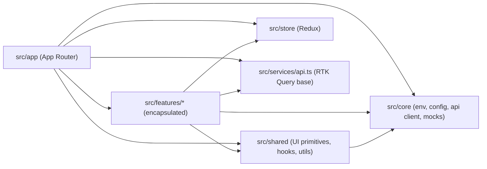
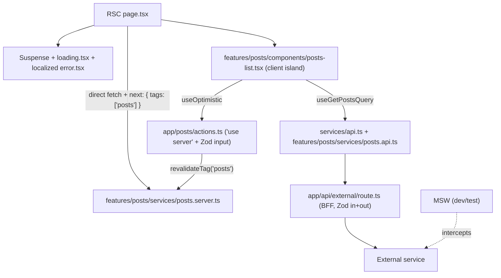

## What changed vs previous plan

The new rules and skills you added trigger several mandatory adjustments:

- **TanStack Query is dropped.** [.cursor/rules/server-state-decision-engine.mdc](.cursor/rules/server-state-decision-engine.mdc) mandates: if `@reduxjs/toolkit` is present, use RTK Query exclusively and do not suggest TanStack. Since you picked Redux Toolkit, all server state goes through RTK Query. (Say the word if you want to override this rule for the boilerplate.)
- **Internal `/api/posts` route is dropped.** [.cursor/rules/nextjs-data-fetching-server-components.mdc](.cursor/rules/nextjs-data-fetching-server-components.mdc) forbids creating intermediate `app/api/...` routes for internal UI data; RSCs fetch directly. The `/api/*` surface is now strictly the BFF layer per [.cursor/skills/nextjs-system-design-infrastructure/SKILL.md](.cursor/skills/nextjs-system-design-infrastructure/SKILL.md).
- **RTK base moves to `src/services/api.ts`** per the canonical path in [.cursor/rules/redux-toolkit-rtk-query-architecture.mdc](.cursor/rules/redux-toolkit-rtk-query-architecture.mdc); features use `api.injectEndpoints()`.
- **Feature folder shape changes** to `models/ services/ hooks/ components/ store/` + barrel `index.ts` per [.cursor/skills/file-structure-architectural-boundaries/SKILL.md](.cursor/skills/file-structure-architectural-boundaries/SKILL.md).
- **CVA stack added** (`class-variance-authority`, `clsx`, `tailwind-merge`, shared `cn`) per [.cursor/rules/tailwind-cva-ui-architecture.mdc](.cursor/rules/tailwind-cva-ui-architecture.mdc); `@apply` is forbidden.
- **Server Actions + `useOptimistic` are now first-class** per [.cursor/rules/nextjs-server-actions-and-optimistic-updates.mdc](.cursor/rules/nextjs-server-actions-and-optimistic-updates.mdc).
- **Visual-stability primitives, segment-level `loading.tsx` / `error.tsx` / `not-found.tsx`** are required per [.cursor/rules/nextjs-app-router-error-suspense-boundaries.mdc](.cursor/rules/nextjs-app-router-error-suspense-boundaries.mdc) and the three `visual-stability-*` rules.
- **Bundle/runtime hardening, middleware, audit script** added per [.cursor/skills/nextjs-bundle-optimization-chunking-strategy/SKILL.md](.cursor/skills/nextjs-bundle-optimization-chunking-strategy/SKILL.md), [.cursor/rules/next-ssr-memory-guardrails.mdc](.cursor/rules/next-ssr-memory-guardrails.mdc), and [.cursor/rules/active-architectural-auditing-capability.mdc](.cursor/rules/active-architectural-auditing-capability.mdc).

## Tech stack (locked)

- **Next.js 16** (16.2.x, App Router, RSC, Turbopack default + stable, Cache Components available)
- React 19.2 (View Transitions, `useEffectEvent`)
- TypeScript 5.1+ strict, Node 20.9+ (per Next 16 minimums)
- Tailwind CSS v4 + CVA + `clsx` + `tailwind-merge` + shadcn/ui
- Redux Toolkit + RTK Query (the only server-state lib)
- React Context (UI / cross-cutting client concerns only)
- MSW v2 (mocks for **external** services in dev + Node tests; gated by `NEXT_PUBLIC_API_MOCKING=enabled`)
- Zod for env, server-action inputs, BFF request/response, forms
- Vitest + React Testing Library + jsdom
- ESLint (flat) + Prettier + Husky + lint-staged + Browserslist
- `@next/bundle-analyzer` (opt-in via `ANALYZE=true`)
- pnpm (default — say if you'd rather have npm)

Optional (off by default, scaffolded but not enabled):

- `react-scan` dev integration via [.cursor/skills/setup-react-scan/SKILL.md](.cursor/skills/setup-react-scan/SKILL.md)
- Playwright e2e per [.cursor/skills/test-case-generation/SKILL.md](.cursor/skills/test-case-generation/SKILL.md) (skipping by default; Vitest+RTL covers your stated scope)
- **React Compiler** (stable in v16) — opt-in via `babel-plugin-react-compiler` and `experimental.reactCompiler: true`. Slows builds (Babel-based); leaving off by default but the config slot is documented so you can flip it on after the project is real
- **Cache Components / `"use cache"` directive** — the new v16 caching model. Plan stays on `fetch(url, { next: { tags: ['posts'] } })` per [.cursor/skills/data-fetching-rigger/SKILL.md](.cursor/skills/data-fetching-rigger/SKILL.md), which still works alongside Cache Components. Migration to `"use cache"` is a follow-up

## Architectural shape

Hybrid feature-first per [.cursor/rules/hybrid-feature-architecture-boundaries.mdc](.cursor/rules/hybrid-feature-architecture-boundaries.mdc), with `src/services` and `src/store` promoted to top-level per the RTK rule:



Data flow follows [.cursor/skills/data-fetching-rigger/SKILL.md](.cursor/skills/data-fetching-rigger/SKILL.md) and [.cursor/rules/nextjs-data-fetching-server-components.mdc](.cursor/rules/nextjs-data-fetching-server-components.mdc):



## Folder layout (final)

```
src/
  app/
    layout.tsx                       # RSC root; mounts <Providers/>; optional react-scan dev guard
    page.tsx                         # RSC home
    loading.tsx                      # root segment skeleton
    error.tsx                        # 'use client' root error boundary
    not-found.tsx
    providers.tsx                    # 'use client': Redux + UI Context
    globals.css                      # Tailwind v4 entrypoint (no @apply)
    api/
      health/route.ts                # status (BFF pattern, Zod response)
      external/[resource]/route.ts   # BFF proxy example (Zod request + response)
    posts/
      page.tsx                       # RSC: direct fetch via posts.server.ts
      loading.tsx                    # segment skeleton matching final layout
      error.tsx                      # 'use client' segment error
      actions.ts                     # 'use server' mutations (Zod input)
  proxy.ts                           # BFF auth/header guard skeleton (Next 16 replaces middleware.ts; runtime: nodejs)
  instrumentation.ts                 # Node MSW bootstrap (dev-only, gated)
  services/
    api.ts                           # RTK Query base (createApi, fetchBaseQuery, tag types)
  store/
    index.ts                         # makeStore() factory + RootState/AppDispatch types
    hooks.ts                         # typed useAppDispatch / useAppSelector
    provider.tsx                     # 'use client' <ReduxProvider/>
  core/
    env/env.ts                       # Zod-validated server + client env
    config/site.ts
    api/client.ts                    # typed fetch wrapper, server-only, Zod parse
    mocks/
      handlers.ts                    # external-service handlers only
      browser.ts                     # setupWorker
      server.ts                      # setupServer (Node)
      init.ts                        # gated bootstrap
  shared/
    components/
      ui/                            # shadcn + CVA primitives
      layout/{site-header,site-footer}.tsx
      feedback/
        skeleton-card.tsx            # contextual loading per visual-stability-contextual-loading-states
        local-error-boundary.tsx     # widget-level error boundary per visual-stability-localized-error-boundaries
        media-frame.tsx              # aspect-ratio wrapper per visual-stability-prevent-layout-shifts
    contexts/ui-context.tsx          # cross-cutting Context (e.g. sidebar) — NOT exported from generic client files
    hooks/use-mounted.ts
    utils/cn.ts                      # clsx + tailwind-merge
    utils/format.ts
    types/index.ts
  features/
    posts/
      models/post.ts                 # Zod schema + z.infer<typeof PostSchema>
      services/
        posts.api.ts                 # api.injectEndpoints({ getPosts, createPost, ... })
        posts.server.ts              # server-only fetch w/ next: { tags: ['posts'] }
      hooks/
        use-posts-filters.ts         # URL state (search params) for filters/pagination
      components/
        posts-list.tsx               # client island; consumes RTK Query auto-hooks
        posts-list.skeleton.tsx      # localized skeleton matching final layout
        post-filters.tsx
      store/posts.slice.ts           # LOCAL UI prefs only (never API data)
      index.ts                       # barrel: only public exports
  test/
    setup.ts                         # jsdom + MSW server lifecycle
    test-utils.tsx                   # render with all providers
scripts/
  audit-architecture.ts              # already present; wired to npm run audit:architecture
.browserslistrc                      # baseline per browser-compatibility rule
.env.example
components.json                      # shadcn aliases -> src/shared/components/ui
eslint.config.mjs
next.config.ts                       # optimizePackageImports + bundle-analyzer wrapper
tsconfig.json                        # strict, paths: @/* @/features/* @/shared/* @/core/* @/services/* @/store/*
vitest.config.ts
```

## Key implementation notes (rule-cited)

- **Server state**: All API data flows through RTK Query auto-hooks injected from `src/services/api.ts`. Slices and thunks are NEVER used for API data ([.cursor/rules/redux-toolkit-rtk-query-architecture.mdc](.cursor/rules/redux-toolkit-rtk-query-architecture.mdc), [.cursor/rules/state-management-decision-matrix](.cursor/skills/state-management-decision-matrix/SKILL.md)). `posts.slice.ts` is intentionally restricted to local UI prefs only.
- **Internal data**: RSCs call `posts.server.ts` directly with `fetch(url, { next: { tags: ['posts'] } })`; no internal `/api/posts` route ([.cursor/rules/nextjs-data-fetching-server-components.mdc](.cursor/rules/nextjs-data-fetching-server-components.mdc)).
- **Mutations**: Server Actions in `app/posts/actions.ts` validate input with Zod, call the data layer, and `revalidateTag('posts')`. Client leaves wrap calls in `useOptimistic` for instant UI ([.cursor/rules/nextjs-server-actions-and-optimistic-updates.mdc](.cursor/rules/nextjs-server-actions-and-optimistic-updates.mdc)).
- **BFF surface**: Only external-service proxies live under `app/api/...`, each with Zod request and response schemas ([.cursor/skills/nextjs-system-design-infrastructure/SKILL.md](.cursor/skills/nextjs-system-design-infrastructure/SKILL.md)). Pre-request guards (auth/headers/locale) live in `proxy.ts` (Next 16 renamed `middleware.ts` → `proxy.ts`; runtime is `nodejs` and the `edge` runtime is no longer supported in `proxy`. If we ever need an edge guard, we'd keep a legacy `middleware.ts` alongside.).
- **Boundaries**: RSC by default; `'use client'` only at interactive leaves. Heavy/high-frequency client modules wrapped with `next/dynamic({ ssr: false })` and skeleton fallbacks ([.cursor/rules/ui-rendering-strategy-and-component-delivery.mdc](.cursor/rules/ui-rendering-strategy-and-component-delivery.mdc), [.cursor/rules/nextjs-intensive-rendering-isolation.mdc](.cursor/rules/nextjs-intensive-rendering-isolation.mdc), [.cursor/rules/client-bundle-and-lazy-loading-discipline.mdc](.cursor/rules/client-bundle-and-lazy-loading-discipline.mdc)).
- **Suspense + Error**: Each segment ships `loading.tsx` + `error.tsx` (`'use client'`) + `not-found.tsx`, plus inline `<Suspense>` paired with `<LocalErrorBoundary>` for async widgets ([.cursor/rules/nextjs-app-router-error-suspense-boundaries.mdc](.cursor/rules/nextjs-app-router-error-suspense-boundaries.mdc), [.cursor/rules/visual-stability-localized-error-boundaries.mdc](.cursor/rules/visual-stability-localized-error-boundaries.mdc)).
- **Visual stability**: Skeletons mirror final layout, `MediaFrame` enforces `aspect-ratio`/`width`x`height` to prevent CLS ([.cursor/rules/visual-stability-prevent-layout-shifts.mdc](.cursor/rules/visual-stability-prevent-layout-shifts.mdc), [.cursor/rules/visual-stability-contextual-loading-states.mdc](.cursor/rules/visual-stability-contextual-loading-states.mdc)).
- **Validation**: Zod is the source of truth for env, server-action inputs, BFF in/out, and forms (`zodResolver`); types via `z.infer` only — no parallel manual interfaces ([.cursor/rules/zod-schema-validation-standards.mdc](.cursor/rules/zod-schema-validation-standards.mdc), [.cursor/rules/zod-schema-validation-typescript-scope.mdc](.cursor/rules/zod-schema-validation-typescript-scope.mdc)).
- **Server runtime hygiene**: `instrumentation.ts` initializes singletons (e.g. MSW node, future logger). No request-scoped data in module globals ([.cursor/rules/next-ssr-memory-guardrails.mdc](.cursor/rules/next-ssr-memory-guardrails.mdc)).
- **Per-request stores**: `makeStore()` invoked per request server-side, wrapped in client `<ReduxProvider/>` with the resolved instance.
- **Styling**: Tailwind utilities only; component variants via `cva`; merge via `cn()`; never `@apply` ([.cursor/rules/tailwind-cva-ui-architecture.mdc](.cursor/rules/tailwind-cva-ui-architecture.mdc)).
- **TS**: strict + `noUncheckedIndexedAccess` + `exactOptionalPropertyTypes`. No `any` ([.cursor/rules/strict-typing-and-api-response-validation.mdc](.cursor/rules/strict-typing-and-api-response-validation.mdc)). `.ts/.tsx` only ([.cursor/rules/typescript-file-language-enforcement.mdc](.cursor/rules/typescript-file-language-enforcement.mdc)). TypeScript 5.1+ minimum per Next 16.
- **Bundler**: Turbopack is the default and stable in Next 16 (no `--turbo` flag needed; webpack stays as fallback). Bundle analysis via `ANALYZE=true next build` and `@next/bundle-analyzer`.

## ESLint hardening (flat config in `eslint.config.mjs`)

- `react-hooks/exhaustive-deps`: `error` ([.cursor/rules/react-hooks-exhaustive-deps-enforcement.mdc](.cursor/rules/react-hooks-exhaustive-deps-enforcement.mdc))
- `no-restricted-syntax` selectors:
  - High-frequency state with `useState` (`mouse|scroll|position|coordinates`) ([.cursor/rules/react-high-frequency-state-restriction.mdc](.cursor/rules/react-high-frequency-state-restriction.mdc))
  - Independent fetches not wrapped in `Promise.all` and `createContext`/Provider exports from generic client files ([.cursor/rules/next-rsc-waterfall-and-client-boundary-guards.mdc](.cursor/rules/next-rsc-waterfall-and-client-boundary-guards.mdc))
  - `@typescript-eslint/no-explicit-any`: `error`
- Boundary plugin (`eslint-plugin-boundaries` or simple `no-restricted-imports`) preventing cross-feature deep imports.

## Scripts ([package.json](package.json))

- `dev`, `build`, `start`
- `lint`, `lint:fix`, `format`, `typecheck`
- `test`, `test:watch`, `test:ui`
- `analyze` (`ANALYZE=true next build`)
- `audit:architecture` (runs [scripts/audit-architecture.ts](scripts/audit-architecture.ts) per [.cursor/rules/active-architectural-auditing-capability.mdc](.cursor/rules/active-architectural-auditing-capability.mdc))
- `mock` (sets `NEXT_PUBLIC_API_MOCKING=enabled` for `dev`)

## Out of scope (explicit)

- No dark mode / next-themes
- No auth provider, DB, or Storybook
- No CI templates (Husky pre-commit only)
- No Playwright e2e (Vitest+RTL only); leave hooks for the testing skill to wire later
- No `react-scan` enabled by default; the integration point is documented but the dependency is opt-in
